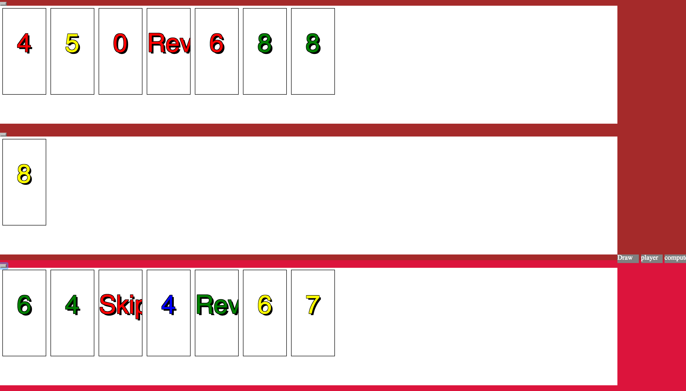

# game1

# PLay UNO!



## The game is called "Play Uno!"?

> PlayUno is a digital card game played between the computer and a user. To start, each, the player and the computer recieve 7 cards. The objective of the game is for either player to end up with only one card left. 

## Technical Discussion

> Technologies used. 
  -HTML
  -CSS
  -JavaScript
 
### Notes on Game Structure
##Code Sample:

```javascript
let checkActionCards=function(card){
   
                console.log (card.special);
                 if (card.special==="DrawTwoCards"){
                    whoseTurnIsIt(SpecialCardDrawTwoCards("player"), true);
                 }
                 else if (card.special==="ReverseCards"){
                     console.log ("ReverseCards was placed ");
                     whoseTurnIsIt( SpecialCardReverseCards("player"), true);
                 }
                 else if (card.special==="SkipCards"){
                     whoseTurnIsIt( SpecialCardSkipCards("player"),true);
                 }
                 else if (card.special==="Wild"){
                     
                     SpecialCardWild("player");
                 }
                else if (card.special==="DrawFour"){
                     SpecialCardDrawFour("player");
                   }
            }  
        

```
> Challenges: A the major challenge encountered was generating a logic that represents the computer intelligently and autonomously responding to the users game inputs. A general automatic out was achieved by using nested function calls and condition statements. 

Further improvements would allow the program to carry out detailed representation of plausible game outcomes. And rank these against eachother with the goal of outputing the set of functions that result in greatest card loss. Thus improving the program's chance of winning the Uno game.   


## The Making of [Your Game]

> Any credits/notes:
 source for uno rules https://github.com/danguilherme/uno

## Opportunities for Future Growth

> If you had more time to work on your game, what would you do?
  Impliment a general automatic game play for the computer. 
 

